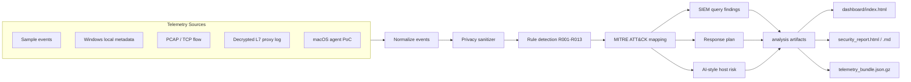

# LayerTrace EDR PoC

**[B조] L7 트래픽 기반 EDR 위협 탐지 및 대응 플랫폼**

Endpoint에서 발생하는 process, network, file, DNS, PCAP, L7 metadata를 모아
보안 위협을 탐지하고, MITRE ATT&CK 기준으로 분류한 뒤 dashboard와 report로 보여주는
로컬 실행형 security PoC입니다.

> Python 3.11+ · 외부 패키지 설치 없음 · Windows local metadata 수집 지원 · 정적 dashboard/report 자동 생성

---

## 한 줄로 설명하면

PC 안에서 생기는 여러 보안 신호를 모아서
`위험한 행동인지`, `어떤 공격 단계인지`, `어떤 대응이 필요한지`를 자동으로 정리해주는
미니 EDR + SIEM 플랫폼입니다.

```text
sample / local endpoint / PCAP / L7 metadata
-> schema validation / DLQ
-> privacy masking
-> detection rules
-> MITRE ATT&CK mapping
-> SIEM query finding / topology
-> AI-style risk prediction
-> response plan
-> dashboard + report + gzip pipeline bundle
```

---

## 아키텍처



---

## 빠른 시작

```powershell
cd poc_code/security_edr_agent_parser
python -m src.run
```

실행하면 최신 결과가 자동으로 생성됩니다.

```text
dashboard/data/latest-result.js
outputs/reports/latest/security_report.html
outputs/reports/latest/security_report.md
outputs/pipeline/latest/telemetry_bundle.json.gz
```

Dashboard는 아래 파일을 브라우저로 열면 됩니다.

```text
dashboard/index.html
```

---

## 자동 검증

전체 PoC가 제대로 동작하는지 한 번에 확인합니다.

```powershell
python scripts\validate_poc.py
```

개별 unit test만 돌릴 수도 있습니다.

```powershell
python -m unittest discover -s tests
```

성공하면 `outputs/verification/latest_verification.json`에 검증 결과가 남습니다.

---

## 실제 Windows telemetry 수집

현재 Windows PC에서 허용된 metadata만 수집해 같은 탐지 엔진과 dashboard에 태웁니다.

```powershell
python -m src.run --collect-local
```

DNS cache까지 보고 싶을 때만 명시적으로 켭니다.

```powershell
python -m src.run --collect-local --include-dns-cache
```

수집하는 것:

| 구분 | 내용 |
|------|------|
| Process | process name, path, parent process |
| Network | established TCP connection, remote IP, remote port, owning process |
| File | Downloads 폴더의 최근 실행/압축 파일 metadata, hash |
| DNS optional | DNS cache domain, answer, record type |

수집하지 않는 것:

| 구분 | 이유 |
|------|------|
| Packet payload | 민감 데이터 가능성이 높음 |
| HTTPS body | 승인 없는 본문 수집 방지 |
| Message/chat content | 개인정보 보호 |
| Keystroke / clipboard | PoC 범위 밖 |
| Document body | 원문 내용 수집 방지 |

---

## PCAP / TCP Flow 분석

`.pcap` 파일을 읽어 TCP flow를 만들고, 평문 HTTP 요청이 있으면 `http_request` event로 변환합니다.

```powershell
python -m src.run --pcap-file samples\some_capture.pcap
```

담당 코드:

```text
src/pcap_flow.py
```

---

## HTTPS / L7 Deep Inspection

이 PoC는 임의의 HTTPS를 몰래 복호화하지 않습니다.
승인된 local proxy/CA 또는 테스트 proxy가 남긴 decrypted L7 metadata를 입력으로 받습니다.

```powershell
python -m src.run --l7-file samples\decrypted_l7_records.json
```

테스트용 explicit proxy도 포함되어 있습니다.

```powershell
python scripts\https_inspection_proxy.py --certfile cert.pem --keyfile key.pem --output outputs\l7_proxy\records.jsonl
python -m src.run --l7-file outputs\l7_proxy\records.jsonl
```

담당 코드:

```text
src/l7_inspector.py
scripts/https_inspection_proxy.py
```

---

## macOS Agent PoC

macOS에서는 `tcpdump` 기반 network metadata를 event schema로 바꿉니다.

```bash
python3 -m src.mac_agent --simulate
sudo python3 -m src.mac_agent --iface en0 --duration 30
```

백그라운드 실행용 LaunchAgent script도 있습니다.

```bash
bash scripts/install_mac_agent.sh
bash scripts/uninstall_mac_agent.sh
```

담당 코드:

```text
src/mac_agent.py
scripts/install_mac_agent.sh
scripts/uninstall_mac_agent.sh
```

---

## Dashboard

`dashboard/index.html`은 `dashboard/data/latest-result.js`를 읽어서 최신 분석 결과를 보여줍니다.

주요 화면:

| 영역 | 내용 |
|------|------|
| 컴퓨터 흐름 | 내 컴퓨터 -> 우리 내부 -> 외부 destination topology |
| SIEM Analysis | 반복 가능한 query finding과 분석 count |
| EDR 상태 | `RED`, `AMBER`, `YELLOW`, `GREEN`으로 실제 위험 상태 표시 |
| 시간 범위 | Grafana식 `Last 10 minutes`, `Last 1 hour`, `Last 24 hours` |
| Severity 전환 | Critical/Warning/Suspicious/Info 즉시 필터 |
| Alert 확인 | 선택한 alert가 우상단 inspector에 표시 |
| Incident Workbench | Falcon / Cortex 계열 콘솔 느낌의 incident 분석 |
| MITRE ATT&CK | tactic별 탐지 분포 |
| Timeline | 시간순 위험 이벤트 |
| Endpoint Risk | host별 risk score |
| Response Playbook | dry-run response action |
| Report Center | report popup, Markdown, PDF 저장 |
| Data Quality | schema validation, DLQ, privacy masking 결과 |

---

## Report

CLI 실행 시 공유 가능한 보안 분석 보고서가 자동 생성됩니다.

```text
outputs/reports/latest/security_report.html
outputs/reports/latest/security_report.md
```

보고서에 들어가는 내용:

| 섹션 | 설명 |
|------|------|
| Executive Summary | 전체 위험도와 핵심 판단 |
| Endpoint Risk | host별 위험도 |
| Incident Summary | 연결된 공격 흐름 |
| Alert Evidence | 탐지 근거 |
| MITRE ATT&CK Mapping | 공격 전술/기법 매핑 |
| SIEM Analysis | 반복 가능한 query finding과 topology summary |
| Deep Inspection / L7 Visibility | L7 metadata 기반 분석 |
| AI Prediction / Response Plan | 예측 위험도와 대응 계획 |
| Pipeline Delivery | gzip telemetry bundle, customer/device/version header, mTLS mode |
| Data Quality / DLQ | 유효하지 않은 event 처리 |
| Recommended Next Actions | 다음 조치 |
| Limitations | 현재 한계 |

---

## Detection Rules

| Rule | 탐지 내용 |
|------|-----------|
| R001 | known malicious domain access |
| R002 | suspicious executable downloaded from browser |
| R003 | unsigned executable started from Downloads |
| R004 | periodic external connection |
| R005 | large outbound transfer |
| R006 | rare ASN connection outside work hours |
| R007 | shell process creates network connection |
| R008 | VPN tunnel plus abnormal transfer |
| R009 | decrypted L7 malicious URL access |
| R010 | risky application action with malicious URL |
| R011 | known malware hash signature match |
| R012 | response action generated for high-risk detection |
| R013 | AI predicted high-risk host trajectory |

Signature sample은 아래 파일에 있습니다.

```text
rules/threat_signatures.json
```

---

## 프로젝트 구조

```text
security_edr_agent_parser/
├── src/
│   ├── run.py              # CLI entrypoint
│   ├── local_collector.py  # Windows local metadata collector
│   ├── pcap_flow.py        # PCAP / TCP flow analyzer
│   ├── l7_inspector.py     # decrypted L7 metadata parser
│   ├── mac_agent.py        # macOS target agent PoC
│   ├── detection_engine.py # detection rules + MITRE mapping
│   ├── ai_predictor.py     # AI-style host risk scoring
│   ├── siem_analyzer.py    # SIEM query finding + topology
│   ├── response_engine.py  # dry-run response plan
│   ├── pipeline.py         # gzip bundle / optional ship-url
│   ├── report_builder.py   # Markdown / HTML report
│   └── privacy.py          # sensitive field masking
├── dashboard/
│   ├── index.html
│   ├── app.js
│   ├── styles.css
│   └── data/latest-result.js
├── samples/
│   ├── default_events.json
│   └── decrypted_l7_records.json
├── rules/
│   └── threat_signatures.json
├── scripts/
│   ├── validate_poc.py
│   ├── create_local_cert.py
│   ├── https_inspection_proxy.py
│   ├── install_mac_agent.sh
│   └── uninstall_mac_agent.sh
├── docs/
│   ├── agent-collector.md
│   ├── reporting.md
│   ├── openapi.yaml
│   ├── telemetry.proto
│   └── cert-mtls-token-refresh.md
├── tests/
└── outputs/
```

---

## 자주 쓰는 명령어

| 목적 | 명령어 |
|------|--------|
| sample data로 실행 | `python -m src.run` |
| Windows metadata 수집 | `python -m src.run --collect-local` |
| DNS cache 포함 | `python -m src.run --collect-local --include-dns-cache` |
| L7 sample 포함 | `python -m src.run --l7-file samples\decrypted_l7_records.json` |
| PCAP 포함 | `python -m src.run --pcap-file samples\some_capture.pcap` |
| pipeline 전송 테스트 | `python -m src.run --ship-url http://127.0.0.1:9000/ingest` |
| 고객사/기기 header 포함 전송 | `python -m src.run --ship-url https://collector.example.local/v1/telemetry:ingest --customer-id acme-demo --device-id kim-minjun-finance-laptop --agent-version 0.1.0` |
| Windows local cert 생성 | `.\scripts\create_local_cert.ps1 -CustomerId acme-demo -DeviceId kim-minjun-finance-laptop` |
| OpenSSL PEM cert 생성 | `python scripts\create_local_cert.py --customer-id acme-demo --device-id kim-minjun-finance-laptop` |
| 전체 검증 | `python scripts\validate_poc.py` |
| unit test | `python -m unittest discover -s tests` |

---

## 문서

| 문서 | 내용 |
|------|------|
| `docs/rebuild-overall-blueprint.md` | 처음부터 다시 구현하기 위한 전체 설계도 |
| `docs/codex-work-safety-scope.md` | Codex 작업 시 학습용/방어적 범위를 명확히 하는 기준 |
| `docs/agent-collector.md` | Win32_Process, Get-NetTCPConnection, DNS cache 수집 설명 |
| `docs/reporting.md` | report 생성, popup, PDF 저장 방식 |
| `docs/openapi.yaml` | Swagger/OpenAPI ingestion 명세 |
| `docs/telemetry.proto` | gRPC 전환용 protobuf 초안 |
| `docs/cert-mtls-token-refresh.md` | local cert, mTLS, token refresh 설계 |

---

## 실패 코드

| Code | 의미 |
|------|------|
| MISSING_INPUT | 입력 파일이 없음 |
| INVALID_EVENT_FILE | event JSON 형식이 잘못됨 |
| NO_VALID_EVENTS | 유효한 event가 없음 |
| DETECTION_ENGINE_FAILED | 탐지 엔진 처리 실패 |
| ADVANCED_COLLECTION_FAILED | PCAP 또는 L7 입력 처리 실패 |
| UNEXPECTED_ERROR | 예상하지 못한 오류 |

---

## 현재 한계

- Production EDR agent, kernel driver, transparent VPN, packet driver는 아닙니다.
- HTTPS Deep Inspection은 승인된 proxy/CA 또는 decrypted metadata log가 있어야 합니다.
- AI prediction은 학습된 ML model이 아니라 feature 기반 risk scoring입니다.
- Threat intelligence는 `rules/threat_signatures.json`에 있는 sample signature set입니다.
- MITRE ATT&CK mapping은 rule 기반 후보 매핑입니다.
- Dashboard는 static HTML/JS입니다. DB, login, real-time streaming server는 없습니다.
- macOS packet capture는 실제 Mac에서 sudo/tcpdump 권한 검증이 필요합니다.

---

## 안전 안내

이 프로젝트는 교육/시연/연구용 로컬 PoC입니다.
학습용, 취업용 포트폴리오, 발표용으로 허가된 본인 기기 또는 실습 환경에서만 사용한다는 전제로 설계합니다.

따라서 개인정보보호 정책, 조직 내부 승인 절차, 상용 보안 컴플라이언스 구현은 이번 PoC 범위 밖입니다.
타인 기기, 회사 장비, 공개 서비스, 무단 네트워크에서의 사용은 대상이 아닙니다.
