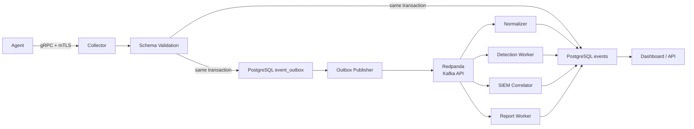

# Event-Driven Queue 설계

이 프로젝트는 event-driven EDR backend로 구현합니다.

---

## 결론

| 질문 | 결정 |
|---|---|
| Kafka를 DB처럼 쓰나? | 아니요. DB는 PostgreSQL입니다. Kafka/Redpanda는 message broker입니다. |
| Kafka를 꼭 써야 하나? | Apache Kafka 자체는 필수는 아니지만, Kafka-compatible broker는 사용합니다. |
| 어떤 broker를 쓰나? | Docker Compose 기준 Redpanda를 사용합니다. Kafka API와 호환됩니다. |
| 병목 대비 queue가 있나? | 있습니다. Redpanda topic과 PostgreSQL outbox/DLQ를 사용합니다. |
| 구조가 event-driven인가? | 예. Collector 이후 분석/탐지/리포트는 consumer가 비동기로 처리합니다. |

---

## 왜 Kafka를 DB로 쓰지 않는가

Kafka 계열 시스템은 event stream을 보관하고 전달하는 데 강합니다.
하지만 서비스의 현재 상태, alert, incident, report, device 정보를 조회하는 primary database 역할에는 PostgreSQL이 더 적합합니다.

따라서 역할을 분리합니다.

| 역할 | 선택 |
|---|---|
| 영속 저장, 조회, dashboard read model | PostgreSQL |
| event buffering, backpressure, worker fan-out | Redpanda/Kafka-compatible broker |
| 실패 event 보관 | DLQ topic + PostgreSQL `dead_letter_events` |

---

## 전체 흐름



Collector는 event를 받은 즉시 모든 탐지를 수행하지 않습니다.
Collector의 책임은 인증, validation, 저장, outbox 기록까지입니다.
나머지는 consumer가 처리합니다.

---

## Topic 설계

| Topic | 내용 |
|---|---|
| `telemetry.raw.v1` | Collector가 받은 원본 metadata event |
| `telemetry.validated.v1` | schema validation과 privacy filtering을 통과한 event |
| `alerts.created.v1` | detection worker가 만든 alert |
| `incidents.created.v1` | 여러 alert를 묶은 incident |
| `reports.requested.v1` | report 생성 요청 |
| `events.dlq.v1` | 처리 실패 event |

---

## 병목 대비

병목은 Collector, broker, worker, DB 중 어디서든 생길 수 있습니다.
그래서 다음 기준으로 처리합니다.

| 병목 지점 | 대응 |
|---|---|
| Collector | gRPC ingest path를 짧게 유지하고, 분석은 worker로 넘김 |
| Broker | topic partition과 consumer group으로 처리량 확장 |
| Worker | detection/SIEM/report worker를 수평 확장 |
| DB | write table과 read model을 분리하고 index를 명확히 둠 |
| 실패 event | retry 후 DLQ topic과 `dead_letter_events`에 보관 |

---

## 왜 PostgreSQL Outbox가 필요한가

Collector가 DB 저장 후 broker publish에 실패하면 event가 유실될 수 있습니다.
반대로 broker publish 후 DB 저장에 실패하면 dashboard에서 조회할 수 없는 event가 생깁니다.

이를 막기 위해 Collector는 같은 transaction 안에서 다음을 함께 기록합니다.

```text
events table insert
event_outbox table insert
commit
```

별도 outbox publisher가 `event_outbox`를 읽어 broker로 publish합니다.
publish 성공 시 outbox row를 `published`로 바꿉니다.

이 방식이면 broker 장애가 있어도 PostgreSQL에 backlog가 남아 나중에 재전송할 수 있습니다.

---

## 구현 우선순위

1. PostgreSQL schema: `events`, `event_outbox`, `dead_letter_events`
2. Redpanda Docker Compose
3. Outbox publisher
4. Normalizer consumer
5. Detection consumer
6. SIEM correlation consumer
7. Report consumer
8. Dashboard read model updater
