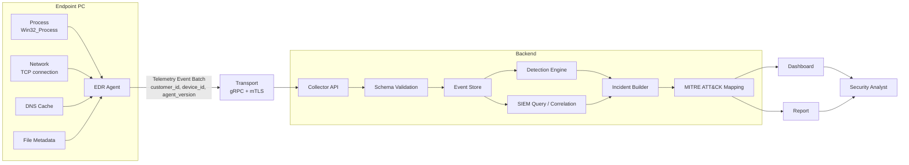

# EDR Agent Parser 신규 구현 전체 그림

이 문서는 팀이 0부터 새로 구현할 때 같은 그림을 보고 개발하기 위한 전체 설계도입니다.

신규 구현에서는 역할을 분리하고, 데이터 흐름을 명확히 하고, Agent, Collector, SIEM, Dashboard, Report를 독립적으로 설계합니다.

---

## 1. 서비스 한 줄 정의

클라이언트 PC에서 발생하는 보안 telemetry를 수집하고, 이상 행위를 분석해, 보안 담당자가 “어떤 PC에서 무슨 일이 일어났는지” 바로 볼 수 있게 하는 EDR 플랫폼입니다.

---

## 2. 우리가 만드는 것

우리는 EDR을 만듭니다.

EDR은 Endpoint Detection and Response의 약자입니다.
Endpoint는 직원이 쓰는 노트북, 데스크톱, 서버 같은 실제 기기입니다.

이 프로젝트의 핵심은 다음입니다.

```text
내 PC에서 무슨 일이 일어났는가
-> 어떤 process가 실행되었는가
-> 어떤 외부 주소로 연결되었는가
-> 어떤 파일이 다운로드/실행되었는가
-> 이 행동이 위험한가
-> 보안 담당자는 어떤 조치를 해야 하는가
```

---

## 2.1 프로젝트 전제

이 프로젝트는 학습용, 취업용 포트폴리오, 발표용 PoC입니다.
상용 배포나 실제 조직 보안 운영을 목표로 하지 않습니다.

전제는 다음과 같습니다.

| 항목 | 전제 |
|---|---|
| 사용 환경 | 본인 기기 또는 명시적으로 허가된 실습 환경 |
| 사용 목적 | 학습, 포트폴리오, 기술 시연 |
| 사용자 범위 | 프로젝트 팀원과 평가자 |
| 데이터 범위 | 실습용 telemetry, sample data, 본인 장비에서 직접 수집한 metadata |
| 운영 정책 | 실제 회사/기관의 개인정보보호, 보안정책, 컴플라이언스 적용은 이번 범위 밖 |
| 배포 범위 | 상용 운영, 고객사 설치, 타인 기기 배포, 공개 서비스 운영은 대상이 아님 |
| 실행 인프라 | Docker, Docker Compose, AWS 같은 인프라는 PoC 실행/데모/검증 용도로 사용 가능 |

따라서 신규 구현에서는 개인정보보호 정책, 조직 내부 승인 절차, 상용 보안 컴플라이언스 구현을 핵심 요구사항으로 두지 않습니다.
다만 발표와 협업에서 오해를 줄이기 위해 “허가된 본인 기기/실습 환경에서만 사용한다”는 제한은 문서에 명확히 남깁니다.
여기서 “상용 배포를 목표로 하지 않는다”는 말은 Docker나 AWS를 쓰지 않는다는 뜻이 아닙니다.
Collector, API, dashboard, report server, database, message queue를 로컬 Docker Compose나 개인 AWS 실습 계정에 올려 데모하는 것은 구현 범위에 포함할 수 있습니다.

Codex로 작업할 때도 이 전제를 먼저 명시합니다.
자세한 작업 범위는 `docs/codex-work-safety-scope.md`를 기준으로 합니다.
이 문서는 보안 차단을 우회하기 위한 문서가 아니라, 방어적/학습용 EDR PoC의 허용 작업과 제외 작업을 명확히 하기 위한 문서입니다.

---

## 3. 우리가 당장 만들지 않는 것

처음부터 상용 EDR 수준을 만들지는 않습니다.
PoC/시연 단계에서는 다음을 제외합니다.

| 제외 항목 | 이유 |
|---|---|
| Kernel driver | 난이도와 권한 이슈가 큼 |
| 실시간 차단 엔진 | 오탐 시 PC 사용을 막을 수 있음 |
| 완전한 HTTPS 복호화 | 학습용에서는 로컬 cert/proxy로 제한하고, 상용 수준의 정책/배포 문제는 제외 |
| 대규모 DB/검색 엔진 | 초기 PoC에서는 흐름 검증이 우선 |
| 계정/권한/멀티테넌트 UI | 나중에 붙일 수 있음 |
| 완전한 ML 모델 | 먼저 룰/시그니처/상관분석으로 충분 |

대신 처음에는 “수집 -> 분석 -> 시각화 -> 보고서”가 끝까지 이어지는 구조를 만드는 데 집중합니다.

---

## 4. 핵심 사용자

| 사용자 | 원하는 것 |
|---|---|
| 보안 담당자 | 어떤 PC가 위험한지, 왜 위험한지, 무엇을 확인해야 하는지 알고 싶음 |
| 관리자 | Agent가 정상 동작하는지, 어떤 고객사/기기에서 데이터가 오는지 알고 싶음 |
| 발표/심사자 | 실제 보안 제품처럼 흐름이 보이고, 기술적으로 납득 가능한 구조인지 보고 싶음 |
| 개발자 | Agent, Collector, Detection, Dashboard를 어디부터 구현해야 하는지 알고 싶음 |

---

## 5. 전체 흐름

```text
사용자 PC
  |
  | 1. Agent가 telemetry 수집
  v
Agent
  |
  | 2. process/network/file/DNS 정보를 event schema로 변환
  v
Transport
  |
  | 3. customer/device/version gRPC metadata와 인증서 기반으로 전송
  v
Collector
  |
  | 4. event 검증, 저장, 정규화
  v
Detection + SIEM
  |
  | 5. 룰 탐지, 상관분석, MITRE ATT&CK 매핑
  v
Dashboard / Report
  |
  | 6. 컴퓨터 -> 우리 내부 -> 외부 destination 흐름과 alert 근거 표시
  v
보안 담당자
```

---

## 6. 전체 아키텍처



---

## 7. 주요 컴포넌트

### 7.1 Agent

Agent는 client PC 안에서 동작합니다.

역할:

- process 목록 수집
- network connection 수집
- DNS cache 수집
- 다운로드 파일 metadata/hash 수집
- event schema로 변환
- collector로 전송

초기 Windows 수집 후보:

| 데이터 | Windows 수집 방법 | event type |
|---|---|---|
| Process | `Get-CimInstance Win32_Process` | `process_snapshot`, `process_start` |
| TCP Connection | `Get-NetTCPConnection` | `network_connection` |
| DNS Cache | `Get-DnsClientCache` | `dns_query` |
| File Metadata | Downloads 폴더 scan/hash | `file_observed`, `file_download` |

Agent가 수집하지 말아야 할 것:

| 제외 항목 | 수집하지 않는 이유 | 대신 수집할 수 있는 metadata |
|---|---|---|
| message body | 메신저/메일/채팅 본문 수집은 EDR을 넘어 spyware처럼 보이며, 탐지에 필요한 신호보다 민감 원문이 많음 | app name, process, destination domain, request time, byte count, policy match |
| browser password | password store 접근은 credential theft와 구분이 어렵고 포트폴리오/학습 PoC에 불필요함 | browser process, suspicious extension/process, known credential-stealer IOC |
| keystroke | keylogging은 공격 행위와 동일하게 보일 수 있고 방어적 EDR demo 가치가 낮음 | process start, parent process, command line, network connection |
| clipboard | token, password, 개인 대화가 섞일 수 있으며 수집 목적을 설명하기 어려움 | paste 행위 자체가 필요한 경우에도 count/시각 같은 synthetic event만 사용 |
| document body | 문서 원문은 회사/개인 정보가 바로 포함될 수 있고 저장/전송 부담이 큼 | file path category, extension, size, hash, created/modified time |
| 임의의 HTTPS payload | 무작위 복호화 payload는 로그인 정보, 메시지, 결제 정보가 섞일 수 있고 무단 감청으로 보일 수 있음 | SNI/domain, URL path, method, status, content-type, byte count, hash, rule match |

핵심은 "탐지에 필요한 신호는 남기고, 원문 내용은 버린다"입니다.
이 프로젝트는 학습용이어도 Codex와 평가자가 볼 때 방어적 EDR로 보여야 하므로, 본문/비밀번호/키 입력/클립보드 같은 데이터는 수집하지 않습니다.
L7 분석은 허가된 로컬 proxy나 test app에서 생성한 record를 기준으로 하고, 저장되는 event에는 원문 body 대신 metadata와 hash만 남깁니다.

---

### 7.2 Transport

Transport는 Agent가 Collector로 데이터를 보내는 구간입니다.

결정: 1차 신규 구현의 기본 transport는 `gRPC + mTLS`입니다.
REST + gzip은 Swagger 설명, local debug, health check, report download 같은 보조 API에만 사용합니다.
telemetry ingestion 자체는 gRPC service를 기준으로 설계합니다.

필수 metadata:

| 값 | 의미 |
|---|---|
| `customer_id` | 고객사 또는 tenant 구분 |
| `device_id` | 기기 식별자 |
| `agent_version` | Agent 버전 |
| `schema_version` | event schema 버전 |
| `sent_at` | 전송 시각 |

gRPC metadata 예시:

```text
edr-customer-id: acme-demo
edr-device-id: kim-minjun-finance-laptop
edr-agent-version: 0.1.0
edr-envelope-version: 2026-07-telemetry-v1
```

---

### 7.3 Collector

Collector는 Agent가 보낸 telemetry를 받는 서버입니다.

역할:

- 인증서 또는 token 확인
- gRPC metadata 확인
- schema validation
- 중복 event 제거
- 저장소에 적재
- 잘못된 event는 DLQ로 분리

Collector에서 중요한 것은 “일단 받은 데이터를 잃지 않는 것”입니다.
분석이 실패해도 원본 metadata와 실패 이유는 남겨야 합니다.

---

### 7.4 Event Store

Event Store는 telemetry를 저장하는 계층입니다.

기본 저장소는 PostgreSQL로 확정합니다.
SQLite는 unit test나 Docker가 없는 local fallback에만 사용합니다.

초기 저장 단위:

```text
customers
devices
events
alerts
incidents
reports
dead_letter_events
```

---

### 7.5 Detection Engine

Detection Engine은 event가 위험한지 판단합니다.

초기 탐지 방식:

| 방식 | 설명 |
|---|---|
| Signature | 알려진 악성 domain, IP, hash와 비교 |
| Rule | 특정 조건 조합을 탐지 |
| Correlation | 여러 event를 시간순으로 묶어 incident 생성 |
| MITRE Mapping | 탐지 결과를 공격 전술/기법으로 분류 |

초기 룰 예시:

| Rule | 의미 |
|---|---|
| R001 | 악성 domain/IP 접속 |
| R002 | browser를 통한 executable 다운로드 |
| R003 | Downloads 폴더의 unsigned executable 실행 |
| R004 | 일정 주기의 외부 연결 |
| R005 | 대용량 outbound transfer |
| R006 | 업무 외 시간 rare ASN 연결 |
| R007 | shell process의 network connection |

---

### 7.6 SIEM Analysis

SIEM은 단순 alert 목록이 아니라, 여러 로그를 모아 검색/상관분석하는 영역입니다.

우리 프로젝트에서 SIEM처럼 보여줘야 하는 내용:

- 특정 PC의 시간순 event
- process -> network -> file 흐름
- 컴퓨터 -> 우리 내부 -> 외부 destination 연결 지도
- 반복 연결, 대용량 전송, 악성 destination 탐지
- alert가 발생한 이유와 관련 event
- DLQ와 수집 품질

SIEM query finding 예시:

```text
Q001: 악성 destination 접속
Q002: 다운로드 -> 실행 -> C2 -> 유출 chain
Q003: 대용량 outbound transfer
Q004: L7 metadata policy hit
Q005: 수집 품질 DLQ
```

---

### 7.7 Dashboard

Dashboard는 보안 담당자가 보는 화면입니다.

첫 화면에서 가장 중요한 것은 메뉴가 아니라 흐름입니다.

초기 화면 구성:

```text
컴퓨터                  우리 내부                    나가는 거
김민준-재무팀-Laptop -> 사내 메일/문서              malware-drop.example
박서연-영업팀-VPN    -> 사내 업무 시스템            rare-storage.example
최하은-개발팀-PC     -> repo.company.test           정상 연결
```

색상 기준:

| 상태 | 색 |
|---|---|
| RED | 즉시 확인 필요 |
| AMBER | 주의 필요 |
| YELLOW | 수집/schema 확인 필요 |
| GREEN | 위험 신호 없음 |
| NOT DETECTED | 해당 흐름에서 alert 없음 |

필수 dashboard 기능:

- 시간 범위: Last 10 minutes, Last 1 hour, Last 24 hours
- severity 즉시 필터
- alert 클릭 시 우상단에 어떤 alert인지 표시
- endpoint/person/device 구분 가능한 이름
- report popup
- PDF 저장

---

### 7.8 Report

Report는 발표/공유용 산출물입니다.

Dashboard가 조사 화면이라면, Report는 “이번 분석 결과를 누군가에게 설명하는 문서”입니다.

포함해야 할 내용:

- Executive Summary
- EDR 상태
- Endpoint Risk
- Incident Summary
- Alert Evidence
- SIEM Query Finding
- MITRE ATT&CK Mapping
- Response Recommendation
- Data Quality / DLQ
- 한계와 다음 조치

---

## 8. 데이터 모델 초안

### 8.1 Telemetry Event

```json
{
  "event_id": "evt-20260706-0001",
  "customer_id": "acme-demo",
  "device_id": "kim-minjun-finance-laptop",
  "host_label": "김민준-재무팀-Laptop",
  "event_time": "2026-07-06T10:00:00+09:00",
  "received_time": "2026-07-06T10:00:02+09:00",
  "event_type": "network_connection",
  "process_name": "chrome.exe",
  "dst_domain": "malware-drop.example",
  "dst_ip": "203.0.113.77",
  "dst_port": 443,
  "bytes_out": 42000,
  "schema_version": "telemetry-v1"
}
```

### 8.2 Alert

```json
{
  "alert_id": "alert-001",
  "rule_id": "R001",
  "customer_id": "acme-demo",
  "device_id": "kim-minjun-finance-laptop",
  "severity": "critical",
  "risk_score": 90,
  "title": "Known malicious destination observed",
  "event_ids": ["evt-20260706-0001"],
  "mitre_tactics": ["Initial Access"],
  "evidence": ["destination matched signature set"]
}
```

### 8.3 Incident

```json
{
  "incident_id": "incident-001",
  "customer_id": "acme-demo",
  "device_id": "kim-minjun-finance-laptop",
  "severity": "critical",
  "risk_score": 100,
  "sequence": [
    "file_download",
    "process_start",
    "periodic_connection",
    "large_outbound_transfer"
  ],
  "decision": "needs_security_review"
}
```

---

## 9. 인증과 전송 방향

### 9.1 왜 mTLS인가

이 서비스는 사용자 로그인보다 기기 신뢰가 중요합니다.
Agent가 설치된 기기가 진짜 고객사 기기인지 확인해야 합니다.

따라서 운영 설계는 다음이 적합합니다.

```text
Agent certificate
-> mTLS connection
-> Collector validates certificate
-> customer_id/device_id header와 certificate subject 비교
-> telemetry 저장
```

### 9.2 Token refresh는 어디에 쓰는가

Token은 보조 권한입니다.

mTLS가 기기 신원을 증명하고, token은 짧은 시간 동안의 API 권한을 표현합니다.

```text
device certificate로 token refresh 요청
-> 짧은 만료 token 발급
-> telemetry 전송 시 token + certificate 함께 확인
```

---

## 10. Transport 선택 확정

선택: `gRPC + mTLS`를 1차 구현 기준으로 확정합니다.

이유:

- device certificate로 기기 신원을 확인하기 좋음
- customer/device/version metadata를 gRPC metadata로 강제하기 좋음
- telemetry event batch와 streaming 전송으로 확장하기 좋음
- protobuf schema로 Agent와 Collector 사이 contract를 고정하기 좋음
- 매 요청마다 ID/PW를 넣는 REST 방식보다 기기 기반 EDR에 더 맞음

REST/OpenAPI의 역할:

- Swagger 문서화
- health check
- admin/debug endpoint
- report download
- local demo fallback

---

## 11. 신규 구현 권장 폴더 구조

```text
security_edr_agent_parser/
├── agent/
│   ├── windows/
│   ├── macos/
│   └── common/
├── collector/
│   ├── api/
│   ├── auth/
│   ├── ingest/
│   └── storage/
├── analysis/
│   ├── detection/
│   ├── siem/
│   ├── mitre/
│   └── response/
├── dashboard/
├── report/
├── contracts/
│   ├── openapi.yaml
│   └── telemetry.proto
├── docs/
└── tests/
```

신규 구현에서는 위 구조처럼 처음부터 Agent, Collector, Analysis, Dashboard, Report를 분리합니다.
특정 기존 폴더 구조를 기준으로 삼지 않습니다.

---

## 12. 구현 단계

### Phase 1. 설계 고정

- 서비스 범위 EDR로 고정
- event schema 정의
- protobuf schema 확정
- OpenAPI는 보조 API 문서로 정리
- dashboard 첫 화면 wireframe 확정

### Phase 2. Agent 수집

- Windows process 수집
- TCP connection 수집
- DNS cache 옵션 수집
- file metadata/hash 수집
- telemetry batch 생성

### Phase 3. Collector

- `TelemetryIngestService/IngestTelemetry` 구현
- schema validation
- DLQ 저장
- customer/device/version gRPC metadata 처리
- mTLS client certificate 검증

### Phase 4. Detection + SIEM

- signature DB
- rule engine
- event correlation
- incident 생성
- MITRE ATT&CK mapping
- SIEM query finding 생성

### Phase 5. Dashboard + Report

- 컴퓨터 | 우리 내부 | 나가는 거 topology
- severity/time range filter
- alert inspector
- report popup
- PDF 저장

### Phase 6. 인증 고도화

- local cert 생성
- collector mTLS 검증
- token refresh 설계 적용
- certificate rotation과 token refresh 흐름 검증

---

## 13. 발표에서 보여줄 핵심 장면

1. Agent가 실제 Windows telemetry를 가져오는 장면
2. 김민준-재무팀-Laptop에서 악성 domain 접속 alert 발생
3. 다운로드 -> 실행 -> C2 -> 대용량 전송 incident로 묶임
4. Dashboard 첫 화면에서 컴퓨터 -> 외부 destination 흐름이 빨간색으로 표시
5. Alert 클릭 시 우상단 inspector에 rule/severity/기기 표시
6. Report popup 열기
7. PDF 저장
8. gRPC/mTLS 기반 transport와 OpenAPI 보조 API 설명

---

## 14. 확정된 구현 결정

다음 결정은 신규 구현의 기준입니다.

| 항목 | 결정 |
|---|---|
| Backend | Python 3.11 collector로 구현. gRPC server가 primary이고, FastAPI/OpenAPI는 health/admin/report/debug 보조 API로만 사용 |
| DB | PostgreSQL을 기본 저장소로 사용. SQLite는 unit test나 Docker가 없는 local fallback에만 사용 |
| Transport | 1차 구현부터 `gRPC + mTLS` 사용. REST ingestion은 기본 경로로 두지 않음 |
| Certificate | PoC 구현은 PEM file 기준. Windows cert store/PFX는 패키징 단계에서 추가 검토 |
| Dashboard | React + Vite + TypeScript SPA로 신규 구현. 정적 HTML은 reference artifact로만 유지 |
| Sample identity | 실제 사람처럼 구분 가능한 한국어 가명 사용. 실제 팀원/지인 개인정보는 넣지 않음 |
| HTTPS/L7 분석 | 허가된 local proxy/test app/sample record만 사용. 저장 event는 URL/method/status/content-type/size/hash/rule match metadata 중심, raw body는 저장하지 않음 |

---

## 15. 최종 목표 그림

```text
Agent가 client telemetry를 수집한다.
Collector가 고객사/기기별로 안전하게 받는다.
SIEM/Detection이 위험 흐름을 분석한다.
Dashboard가 컴퓨터 -> 내부 -> 외부 흐름과 alert를 보여준다.
Report가 분석 결과를 공유 가능한 문서/PDF로 만든다.
```

이 그림이 이번 신규 구현의 기준입니다.
